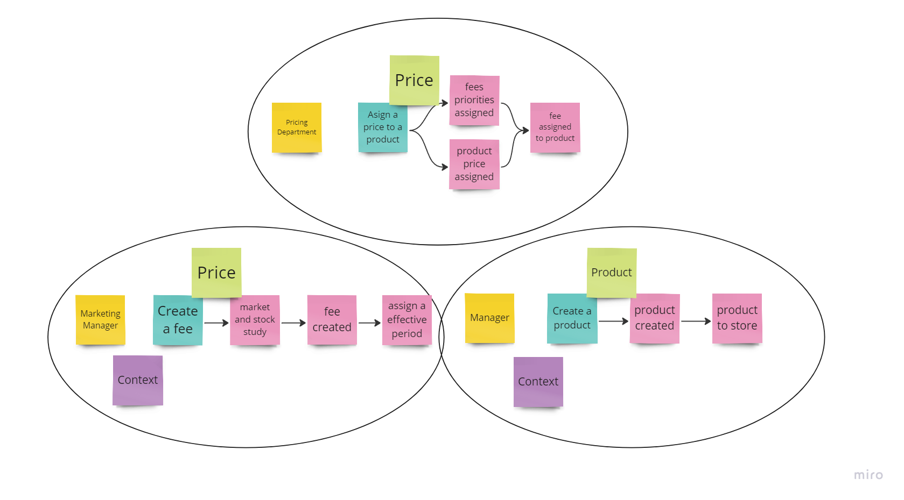
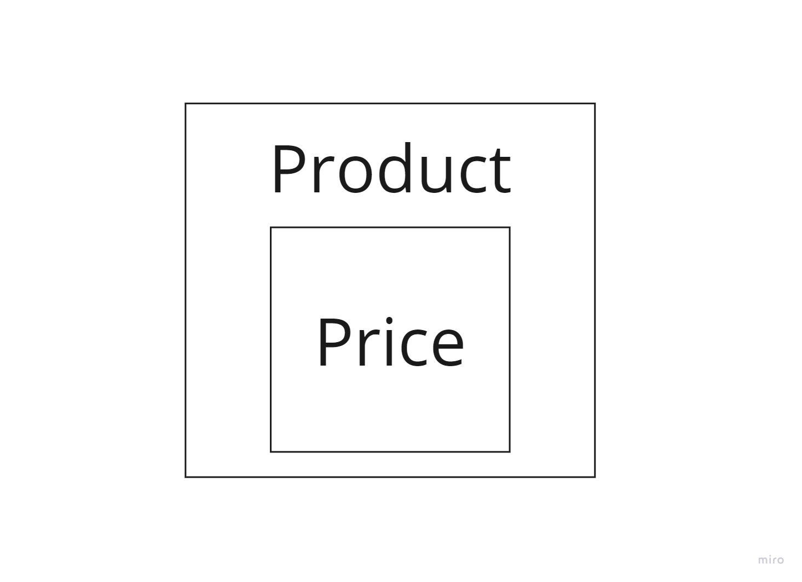

# Inditex Caso Práctico


## Índice

- [Inditex Caso Práctico](#inditex-caso-pr-ctico)
    * [Índice](#-ndice)
    * [Enunciado](#enunciado)
    * [DDD estratégico: Planteamiento y análisis](#ddd-estrat-gico--planteamiento-y-an-lisis)
    * [DDD táctico: implementación](#ddd-t-ctico--implementaci-n)
        + [DDD purista](#ddd-purista)
        + [ID Incrementales](#id-incrementales)
        + [Naming de los casos de uso](#naming-de-los-casos-de-uso)
    * [Testing](#testing)
        + [Controller](#controller)
        + [Use Cases](#use-cases)
        + [TDD](#tdd)
- [Integración Continua](#integraci-n-continua)
- [Dockerización](#dockerizaci-n)
- [Levantar el servidor](#levantar-el-servidor)
- [Contacto](#contacto)

## Enunciado

En la base de datos de comercio electrónico de la compañía disponemos de la tabla PRICES que refleja el precio final (pvp) y la tarifa que aplica a un producto de una cadena entre unas fechas determinadas. A continuación se muestra un ejemplo de la tabla con los campos relevantes:

| BRAND_ID | START_DATE          | END_DATE            | PRICE_LIST | PRODUCT_ID | PRIORITY | PRICE | CURR |
|----------|---------------------|---------------------|------------|------------|----------|-------|------|
| 1        | 2020-06-14-00.00.00 | 2020-12-31-23.59.59 | 1          | 35455      | 0        | 35.50 | EUR  |
| 1        | 2020-06-14-15.00.00 | 2020-06-14-18.30.00 | 2          | 35455      | 1        | 25.45 | EUR  |
| 1        | 2020-06-15-00.00.00 | 2020-06-15-11.00.00 | 3          | 35455      | 1        | 30.50 | EUR  |
| 1        | 2020-06-15-16.00.00 | 2020-12-31-23.59.59 | 4          | 35455      | 1        | 38.95 | EUR  |

Campos:

BRAND_ID: foreign key de la cadena del grupo (1 = ZARA).
START_DATE , END_DATE: rango de fechas en el que aplica el precio tarifa indicado.
PRICE_LIST: Identificador de la tarifa de precios aplicable.
PRODUCT_ID: Identificador código de producto.
PRIORITY: Desambiguador de aplicación de precios. Si dos tarifas coinciden en un rango de fechas se aplica la de mayor prioridad (mayor valor numérico).
PRICE: precio final de venta.
CURR: iso de la moneda.

Se pide:

Construir una aplicación/servicio en SpringBoot que provea una end point rest de consulta  tal que:

Acepte como parámetros de entrada: fecha de aplicación, identificador de producto, identificador de cadena.
Devuelva como datos de salida: identificador de producto, identificador de cadena, tarifa a aplicar, fechas de aplicación y precio final a aplicar.

Se debe utilizar una base de datos en memoria (tipo h2) e inicializar con los datos del ejemplo, (se pueden cambiar el nombre de los campos y añadir otros nuevos si se quiere, elegir el tipo de dato que se considere adecuado para los mismos).

Desarrollar unos test al endpoint rest que  validen las siguientes peticiones al servicio con los datos del ejemplo:

-          Test 1: petición a las 10:00 del día 14 del producto 35455   para la brand 1 (ZARA)
-          Test 2: petición a las 16:00 del día 14 del producto 35455   para la brand 1 (ZARA)
-          Test 3: petición a las 21:00 del día 14 del producto 35455   para la brand 1 (ZARA)
-          Test 4: petición a las 10:00 del día 15 del producto 35455   para la brand 1 (ZARA)
-          Test 5: petición a las 21:00 del día 16 del producto 35455   para la brand 1 (ZARA)


Se valorará:

Diseño y construcción del servicio.
Calidad de Código.
Resultados correctos en los test.


## DDD estratégico: Planteamiento y análisis

Para poder abordar el problema, he analizado el enunciado para intentar extraer el [lenguaje ubicuo][ubiquitous language]. No hay demasiado que sacar aquí, pero he podido extrar el concepto de **Producto** (`temporalProduct`), **Brand** (`brand`), **Precio ** (`price`), y **criterios** (`criteria`).

Una vez hecho esto, he realizado un mini workshop de [Event Storming][event storming] para explorar aún más el lenguaje ubicuo y empezar a modelar los eventos, comandos, agregados y entidades que podrían tener lugar en este proyecto ficticio. [Este es el enlace para poder ver el board en Miro][event storming workshop].



Finalmente, he pasado a limpio el workshop y me he quedado con 3 agregados para simplificar el problema:



Para no complicarlo más, he decidido tener un único core domain con un único bounded context, llamado **Store**.

Finalmente, tenemos un único agregado:
* TemporalProduct: Encargado de reflejar el precio que tendrá un producto en un momento dado.

## DDD táctico: implementación

### DDD purista

En esta prueba he decidido implementar todo de forma muy purista. Absolutamente, nada de la capa de dominio o aplicación dependen de elementos de infraestructura o elementos del framework.

Esto tiene ventajas y desventajas. La ventaja es que podemos cambiar la implementación de cualquiera de los repositorios de manera trivial y aislada. Si mañana tomamos la decisión de mover el repositorio de productos a un MongoDB, cambiar de un RabbitMQ a un SQS, se nos actualiza la librería de persistencia, o cualquier problema relacionado con terceros, solo tenemos un único punto donde tocar nuestro código. El framework no está contaminando nuestro código.

La desventaja es que esto aumenta mucho la complejidad del proyecto, ya que tenemos que serializar y deserializar los objetos cada vez que atravesamos las capas de la arquitectura hexagonal. Estas decisiones "puristas" tienen impacto, y es algo que hay que saber manejar y analizar los riesgos y costes que tenemos al acoplarnos al framework, o no.

### ID Incrementales

En el enunciado los productos tienen un ID incremental. El problema con los ID incrementales, es que si los generamos por la BBDD, esta propiedad es nula en su momento de creación, lo cual nos obliga a gestionar nulos para su creación.

De todas maneras, en mi experiencia es más sencillo implementar los identificadores como UUID, ya que esto abre las puertas a futuro a tener una arquitectura más asíncrona y escalable.

### Naming de los casos de uso

Es una buena práctica que nuestras clases tengan un sustantivo por nombre como `ProductCreator`, pero en el caso particular de los casos de uso, en mi opinión, aporta más legibilidad que se llame como una acción, por ejemplo `CreateProduct`.

## Testing

### Controller

Para el testing de la API, he incluido una serie de tests de integración que me permiten llevar a cabo los tests pedidos en el enunciado. Estos tests son E2E, y se encargan de probar la API desde fuera, como si fuera un usuario.
Para ello he utilizado la librería de RestAssured, que me permite hacer peticiones HTTP y comprobar los resultados.

### Use Cases

Para los casos de uso, he utilizado JUnit y Mockito para hacer tests unitarios. En estos tests, me he encargado de probar la lógica de negocio de los casos de uso, sin tener que levantar la API.

### TDD

Me hubiera gustado hace acopio de la técnica de TDD para llevar a cabo esta prueba, pero aun no la domino lo suficiente. En mi opinión, es una técnica que requiere de práctica pero que a la larga aporta muchos beneficios, tales como obtener un código más conciso, simple y reduce la [complejidad accidental][accidental complexity].

Por último, en algunos puntos de los tests hay datos que están hardcodeados. Esto es intencional, para prevenir cambios accidentales en el código que puedan provocar una rutra en la API, como el nombre de un evento.

# Integración Continua

El proyecto tiene integración continua con Github Actions. Se construye la API y se lanzan los tests.

# Dockerización

El proyecto está dockerizado con una imagen multistage, para evitar el código fuente acabe en el contenedor de producción y así aligerar la imagen.

# Levantar el servidor

Una opción es usar Docker:

```
docker compose up
```

O, directamente con Maven:

```
./mvnw spring-boot:run
```

Ojo, estoy usando elementos en preview de Java 17, por lo que es posible que tengamos que establecer la variable de entorno `JAVA_TOOL_OPTIONS=--enable-preview`.

# Contacto

* Email: eduperz38@gmail.com

[iddd book]: https://www.amazon.es/Implementing-Domain-Driven-Design-Vaughn-Vernon/dp/0321834577
[ubiquitous language]: https://othercode.es/blog/domain-driven-design-lenguaje-ubicuo
[event storming]: https://www.eventstorming.com
[event storming workshop]: https://miro.com/app/board/uXjVKRAH_rw=/?share_link_id=630634142392
[accidental complexity]: https://es.wikipedia.org/wiki/Accidental_complexity 